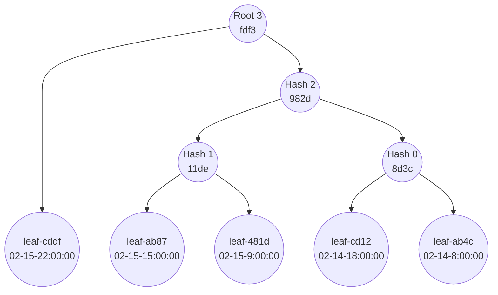
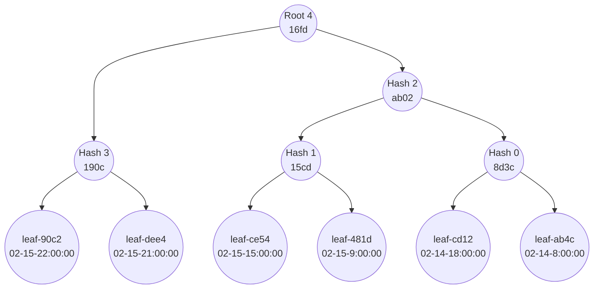
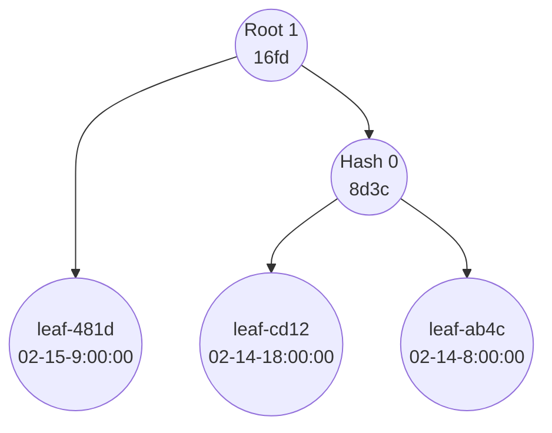
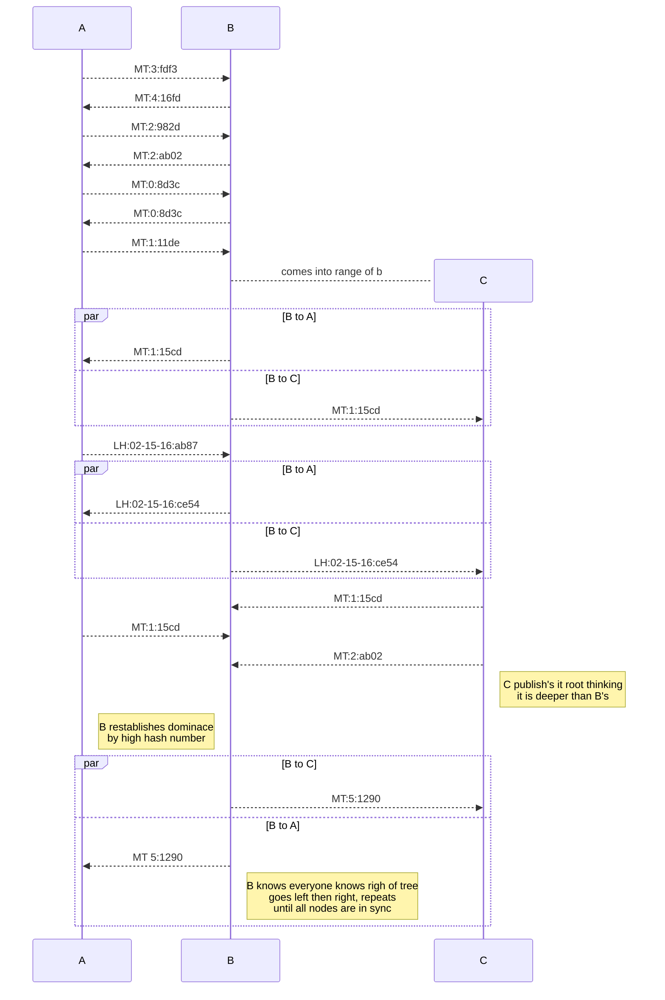

# SneakerNet: resilient asynchronous networks for adverse environments.

Abstract: In mountainous or sparsely populated places with little infrastructure communication and power can be a challenge. The use of portable battery packs as basic power infrastructure opens up the potential of adding communication to these batteries which is always on. Making each battery as small store and forward server using spectrum diverse low power wireless communication technologies to synchronize data between nodes as they physically move around during normal usage cycle and over low bandwidth LoRa links. Allowing for basic text based systems akin to the dial-up days of BBSs in the early 90s. 

## Overview of technologies 
The cost of lithium portable electrical storage continues to drop and become more and more robust with the roll out of LiFePO4 in many devices. 
With these developments there are companies such as LiquidStar are providing meaningful power to communities beyond the grid with a current pilot in Djibouti deploying 75 of these batteries.
55 of these batteries have built in tracking,logging, and communication as they are intended to be rented out and gather usage data. 
Tech includes LoRa radio, ESP32, Swarm satellite comms, 4gb SD card, GPS, and an expansion port that can be used for 4g radio or similar device. 

### LoRa
LoRa is great at long range low bandwidth communications. 
Usually only in the range of a 10s of bps to 10s of kbps.
It operates in the relatively low frequency ISM band 433-915mhz depending on locale.
It uses a spread spectrum chirp encoding which is great for long distance and noise immunity. 

### ESP-NOW
ESP-NOW can be used in tandem with the ESP acting as a wifi hotspot and is a connectionless protocol that does both unicast and broadcast communications. 
It's ability to have very immediate data transfer is great for fast moving nodes that may only have a few seconds of connection.
It has similar range as wifi as it uses the 2.4ghz radio to do ESP-NOW and has a max connection speed of 1mbps

### WiFi
Everyone knows what it is, the particular standard available on the testbed chips is WiFi 4.
While this has the highest bandwidth up to 150mbps real world would be much less.
Another drawback is the time it takes to connect to a hotspot can take at least a few seconds


## Protocol Description
We will be using both the LoRa radio and the ESP32 using both ESP-NOW and WiFi for state, routing, and data transfer.
Each device has a GPS that can be used to precisely synchronize clocks which allows for optimization of settings for LoRa transmissions setting and discovering nodes that have very weak signals. 
The GPS can also give us location information allowing nodes know when they get close to other nodes, it will also give us velocity.
Each node will use a static MAC address of the ESP32 chip as a node identifier. 


### Modes of Operation

* High Velocity
When node detects it is moving at high speed where WiFi might only be in range for a few seconds it will default to using ESP-NOW to broadcast it's MAC address. 
When a node sees this broadcast it responds to it over unicast then attempts to syncronize as much data while in range.
* Low Velocity
When node detects slower speeds it will continuously scan WiFi looking for nearby hotspots to connect and then synchronize over wifi at maximum speed via IP.
* Stationary
When a node isn't moving it will connect to anything it can with the highest bandwidth option, falling back to LoRa for longer range nodes.


In order of priority of the messages handled over LoRa:
1. routing table, whose nearby in terms of signal strength, every message has the sender's MAC address embedded so this automatic in all communication
2. Explicit location services, this would be exchanging current GPS locations to further enhance exchange of data during batteries transiting
3. State synchronization, these are small communications tailored for synchronizing the state of data held across all the nodes, merkle tree and leaf hashes.
4. Data synchronization, after/during state synchronization leaf data is requested via the hash of the leaf as the ordering doesn't matter the hash will alway retrieve the right data even if a node is not fully in sync


The primary use for the LoRa is to build a routing table for ESP-NOW as unicast requires knowing the counterpart's MAC address, this MAC would also be used to creat unique WiFi hotspot names.
Unicast on ESP-NOW provides an ACK back to transmitter thus maximizing the bandwidth usage by not retransmitting already recieved information while maximizing synchronization speed.


### Syncronization 
The simplest lowest overhead way to minimize latency and bandwidth used is to put each event/data change into a merkle tree on each node, ordering the leaves by GPS timestamp.
By generating hashes in a deterministic order based off of the ordered leaves we can include a hash number so in a broadcast domain with multiple listeners there is less communication between nodes because every message regardless of previous messages can provide information to listeners.
See the examples below to see the hash numbering in practice, it simply is building the oldest trees deepest first. 
This would allow one to walk down the tree finding the last synchronized point in O(log(n)) messages. 
With deterministic ordering of the walk down the tree to find the synchronized points the pattern in which the hash numbers are broadcast can allow the listen to infer location in the tree.
Even a node joining in the middle of a conversation the messages can be stored and incorporated into the tree when it fits the right shape, though will not be possible if too far out of sync they would be discarded.
With a fluctuating nodeset m with each separately different data set worst case would be O(m*nlog(n)) messages assuming node time is long compared to O(nlog(n))
The goal of these design choices is to minimize time on air since most of the connectivity will be over the severely limited LoRa bandwidth.
If we were in adversarial condition authentication and associated PKI would have to be layered onto this, to avoid trivial denial of service. 


The for the following steps exchanges will have format something like the following, minimizing time on air will utilize implicit mode in LoRa with CRC, or pack multiple messages in one ESP-NOW packet 

| 2B MsgType  | 6B  | 4B         | 6B   | Description| 
|-------------|-----|------------|------|------------|
| MT | MAC | Hash Number | Hash | Merkle tree sync |
| LH | MAC | Time Stamp  | Hash | leaf sync|


Consider the following charts these are the generated merkle trees for the following nodes

Node A


Node B


Node C


Here is the sequence diagram of synchronizing Nodes A, B, and C, with C coming in the middle of the synchronization 
Github has a problem rendering the sequenceDiagram but feel to use a mermaid renderer with the following code if it doesn't render properly

This is just a snippet of the messages the rough step though

Steps:
1. Exchange root hashes when a new node is encountered 
2. Compare, if different exchange the next right hash in the tree, repeat until match found
3. When there is a match go up one level traverse down the left fork then back to step 2 until the difference is a leaf
4. put new leaf in order based on timestamp, recalculate tree, compare and traverse back up the tree repeat step 2 until roots match

As hashes leaves of the merkle tree are discovered that are missing the data can then be requested from either the LoRa radio or any ESP-NOW nodes within range. 


### Priority Queues 
To expand on the idea of merkle tree synchronization you could have O(mlog(n))speed but have m priority queues, this new compute complexity only applies to the detection synchronization points and not the actual data synchronization which which happens at a constant rate. 
Each queue being defined by a merkle tree of important messages.
Each queue would be processed in order of priority, creating a sparse version of lowest queue which would contain all data.
This would allow each sparse tree to detect in O(log(n)) n with n reducing by difference from low priority queue to high however the savings would be in the reduction of data relating to detecting those diffs.
This would allow for the sparse synchronization of the most important and lowest bandwidth data first giving the best quality service possible for nodes in transport. 


## LoRa Optimization
Using the GPS receiver to coordinate the timing of shifting through settings such as Spreading Factor, Coding Rate, and Bandwidth nodes can discover each other and determine which other nodes are within range with different settings. 

### Syncronized Messaging(syncMsg)
When shifting through the settings all radios will have the highest possible connectivity to other nodes. 
Since this synchronization will have to happen regularly it might as well be used to pass messages that are always highest priority, routing information.
These messages will simply have the MAC address of the ESP32 for the node along with the number of nodes that were visible by the end of the last scan period for that particular setting of the LoRa. 
At the most robust/long range setting each node broadcasts it's MAC and then the schedule of time it will spend in settings in order they were shifted through to reduce the amount of bandwidth used since it will be the lowest data rate of all settings. 

```
settingArray = [
    {"SpreadingFactor": 7, "CodingRate": "4/5", "Bandwidth": 125000},
    {"SpreadingFactor": 8, "CodingRate": "4/6", "Bandwidth": 125000},
    {"SpreadingFactor": 9, "CodingRate": "4/7", "Bandwidth": 125000},...
```

The order in which the setting are ran through will progress from the highest bandwidth shortest range to the lowest bandwidth longest range.
During syncMsg these settings are rant through in a short period of time.

After determining other nodes at the different frequency the actual data period begins. 
This will go through in the same order as the sync message period but much longer period. 
Each node will go skip ahead in the schedule until there is a node it can reach and then spend as its time on the setting until the schedule tells it to move on to lower bandwidth longer range settings. 
Further optimization would allow nodes to communicate their optimal order/time spent on the a particular setting to maximize throughput and range and override the schedule. 
This wouldn't override the syncMsg time to ensure discovery more optimal settings. 


### ESP-NOW Optimization
Given the requirement of the routing table to have guaranteed communication as described above LoRa will be utilized to fullfil this requirement. 
There is another faster solution but would be less useful most of the time. 
You can use the broadcast mode to transmit the MAC address when the node is detected to be moving quickly. 
In broadcast you don't need to know your peers but if you are moving quickly being able to connect and transfer data quickly is important. 
When one of these broadcasts are received the receiver adds it to it's routing table and tries to start synchronizting as quickly as possible.
One optimization for this quick transport would be to choose, for the whole fleet the only one wifi channel all nodes will run on for ESP-NOW. 
This will cause problems when many are in close proximity but at charging stations you can use the home WiFi network to turn them into clients and only try to talk with the network instead of wastefully over the mesh. 


